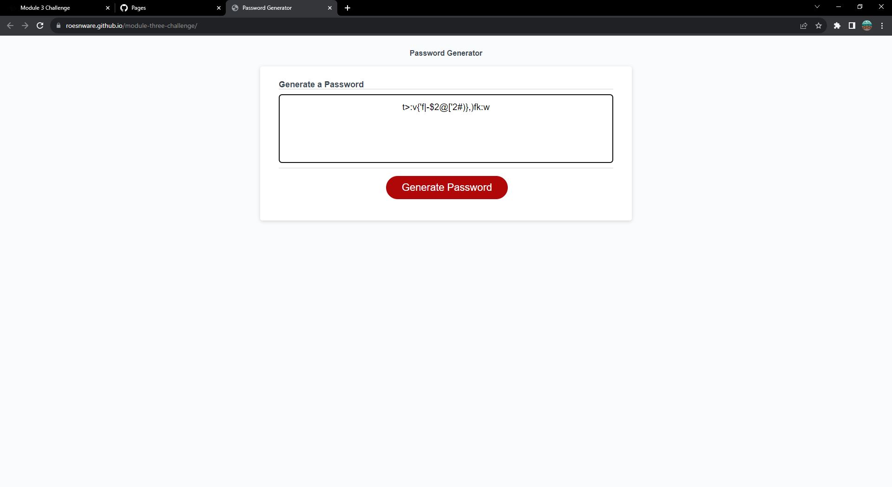

# Module 3 challenge 

## Description

My motivation whilst creating this repository was to make an application that creates a random secure password when fed importasnt criteria to include and not include. I accomplished this by creating prompting the user with prompts to get specific data, confirming whether or not we should include this is the criteria, and alerts to amke sure our data and input collecting fits the criteria and scope.

## Table of Contents 

N/A

## Installation

N/A

## Usage

This application can now be utilized by anyone who would like to generate random passwords given specific criteria.

## Credits

N/A

## License

Please refer to the LICENSE in the repo.

## Screenshot

## Deployment link

https://roesnware.github.io/module-three-challenge/
